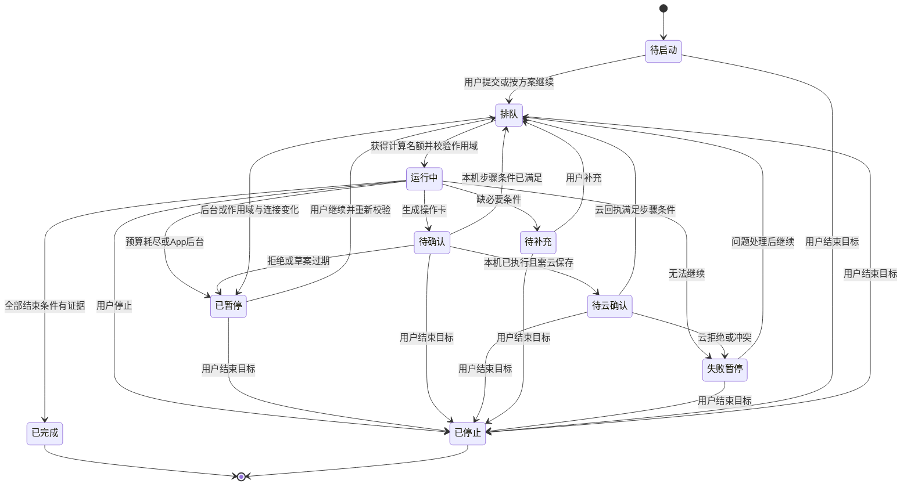
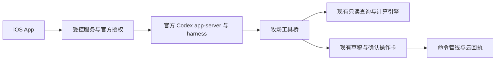

# AI 助手 iOS 完整交互设计方案

日期：2026-10-01
状态：已开始按本方案实现，当前交付为源码；尚未通过 iOS 编译、真机验收或发布。具体完成范围和验证证据见 [实现记录](ai-assistant-ios-implementation-2026-10-01.md)。本文的接受标准仍是待验收要求。

本方案供产品、设计、iOS 与验收人员共同使用。以用户提供的 ChatGPT 截图为视觉依据，重新定义输入框、附件、思考设置、方案和目标的完整交互；保留现有操作卡及其审核链路。核心约束是：分析可以连续推进，真实牧场操作必须经过原有确认；界面始终区分分析、待确认、本机执行和云端确认。

## 1 范围与现有基础

| 能力 | 当前源码基础 | 本方案新增内容 |
| --- | --- | --- |
| 对话 | 历史会话 sheet、搜索、上下文估算、停止生成 | 列表先行导航、会话草稿恢复、输入框三态 |
| 图片与语音 | 相机、照片、最多四张图片、语音输入和本机回听 | 附件状态统一、语音预览与新输入框组合 |
| 文件 | 结构化导入预检和待确认导入草案 | 独立的文件分析附件，不能与导入混用 |
| 工具 | Harness 多轮查询、确定性计算、有限重试与答案复核 | 分档运行预算、过程展示、目标检查点 |
| 业务操作 | 操作卡、编辑、拒绝、权限和 revision 校验 | 目标与卡片关联、失败恢复和结束条件 |
| 思考 | 请求目前关闭思考，界面不展示思考流 | 三档 App 分析策略、原生思考与本机记录 |
| 服务 | 当前 MiMo 直连与本机 Key | 正式评估 ChatGPT 订阅授权与官方 Codex harness |

上表记录设计时的源码基础。后续已实现列表、输入框、方案与前台目标的源码，后台持续任务不在本轮范围内。此前称重修复保留在工作区；新增回归用例不等于已通过 iOS 编译、XCTest 或真实牧场验收。设计与实现均未修改实际牧场业务数据。

## 2 聊天列表与入口导航

### 2.1 常规入口与现有历史

常规入口严格为“聊天列表 → 点击某聊天 → 聊天界面”，不能直接续接上次选中的聊天。`eSheepNext/Features/Workspace/SecondaryViews.swift:42` 当前直接推 `FarmInsightConversationView`；`InsightConversationHistoryView` 当前仍是聊天页 sheet。这两处必须改成列表根页面和按 conversationID 选择的聊天目的地，不只是把旧历史 sheet 换名字。

原有会话、消息、附件和操作卡全部迁入同账号、同牧场列表，保留原 ID、排序时间与关联，不丢历史。列表先按账号和牧场隔离，再按真实执行宿主筛选；不能用服务商名称或“已云同步”推断宿主。旧历史缺宿主信息时保留在“全部”，详情标“来源未记录”；设备断连的历史仍在“全部”保留并标来源离线，不伪装成当前设备任务，也不因断连删除。

读取本机已授权历史不依赖模型连接成功；缺 Key、订阅授权过期或云端不可用时仍可查看，启动新任务另行校验连接。

### 2.2 列表布局与真实状态

以用户的 Codex 列表截图为结构：顶部左菜单、中央服务名下拉、右搜索；下方横向“全部、云端、设备”筛选；“最近”标题行右侧新建图标。中央显示当前已启用服务，默认 MiMo；Codex 在资格及连接通过后显示。云端和设备筛选仅列真实可用连接，未接入宿主不做假入口；已有离线历史可保留并说明不可运行。

左菜单进入牧场切换、连接管理与 AI 设置，切换牧场遵循任务暂停和作用域隔离规则。中央下拉选择新聊天草稿使用的已授权服务，保留草稿并重新预检附件；已有聊天继续使用其绑定的 provider 与 threadID，不能靠切换列表服务把旧线程移交给另一服务。

最近聊天用单行标题和轻量分隔，长标题省略，禁止大头像和卡片网格。右侧旋转圈只对应实时处理中；排队、待确认、待云确认、暂停、失败为互斥主状态，由真实事件决定，不能用旧 streaming 标记伪造。完成可显示未读小点；查看聊天不改 updatedAt 或重排列表。聊天显示当前任务或最近完成状态，不把一轮模型结束当目标完成。

搜索是独立本机查询，限定当前账号和牧场的标题及已保存可见消息，不发送模型消息，也不搜索未提交草稿。标题命中打开聊天；消息命中带 conversationID 和准确 messageID 定位，不能只打开底部。取消搜索或返回列表恢复筛选、滚动位置与新聊天草稿。

### 2.3 列表输入与新聊天草稿

列表底部采用截图的胶囊：加号、占位文字、麦克风、箭头。空白箭头灰色且禁用，不显示会话内的黑色波形；这里只编辑“新聊天”草稿，不能把内容续接到 lastSelectedConversation。附件与语音仍按当前服务预检，保留选择器取消和处理失败时的原稿。

未关联会话的草稿拥有独立 draftID，按账号和牧场保存。列表输入框与新建图标打开的“新聊天”页编辑同一份未提交草稿：无稿时为空白，有稿时继续原稿，返回不覆盖或清空。已有会话草稿使用各自 conversationID，三者不能混用；主动清空或成功提交后创建新的 draftID。

首次有效发送时，用稳定创建 UUID 和提交 ID，在一个本机事务中保存一个会话、首条消息及任务登记，并绑定原 draftID，成功后 push；连点和网络重试复用同一 conversationID 与首消息 ID。保存失败保留未提交草稿，不提前产生列表行。发送前没有持久空聊天；新建入口只打开草稿，首次发送仍走同一事务。

分析中心的 initialPrompt 先填入列表新聊天草稿，不自动发送。显式深链可以在列表作为返回根的前提下 push 已校验作用域的特定聊天，并按 messageID 定位。新建只停止当前录音、保存原稿，不停止其他聊天的生成；新聊天不继承旧聊天草稿。

### 2.4 会话导航与删除

会话左侧返回列表，空白稿标题“新聊天”，已有会话显示实际标题，下方为牧场。右侧保留新建与更多；更多包含重命名、删除、详情、聊天内搜索和设置。删除意图先登记并从列表移除，停止活跃 turn、对账已提交请求与回执后 soft delete；晚到结果检查删除中或已删除标记，不能恢复记录。删除失败显示可重试状态。未执行目标停止，待确认卡不自动执行；已执行事实和回执不随聊天删除，原云操作独立同步。

### 2.5 前台任务协调与列表验收

列表属于同一 AI 模块前台，返回列表不等于 App 后台。App 级、按账号和牧场隔离的 SessionCoordinator 持有生成与目标；页面只订阅显示，不能在 View.onDisappear 直接停止。再次打开现有会话只订阅任务，不重新启动。返回列表或同牧场换聊天时只读步骤可继续；操作卡等待用户打开原聊天确认。方案 ready 即结束本次规划，不自动变目标。

并发设计初值最多两个正在计算的线程，各自独立作用域、预算、provider、threadID 和检查点。超过上限显示可取消排队；待卡、待云确认、暂停、排队均不占计算槽。排队不提前调用模型，开新草稿不追加预算，跨线程不借用额度。该值须经真机、服务配额和耗电测试调优，不是实测承诺。

同一 conversationID/threadID 最多一个活跃 turn；两个计算槽用于不同会话。同会话仍在生成时，下一条输入保留在草稿，发送入口解释“请先停止当前回复”。确认卡、云回执、补充信息或用户继续使任务可恢复后，先重新申请计算槽；满额则进入排队，不能从等待态直接绕过并发上限运行。

以下十项是新增接受标准：

1. 所有常规入口先到列表，点击后进入指定聊天。
2. 旧历史、附件和操作卡完整保留，不重建或改 ID。
3. 账号、牧场和真实宿主筛选隔离正确。
4. 列表与会话草稿在取消选择器和模式切换后保留。
5. 新建不产生空列表行，空白发送始终禁用。
6. 首次发送和重复点击只创建一个会话与首消息。
7. 返回列表恢复筛选、滚动位置和原草稿。
8. 运行圈和待确认等状态来自真实任务，返回列表仍可更新。
9. 两线程与排队、取消符合上限，同会话单活跃 turn，等待恢复重新申请名额，不隐式增加预算。
10. 切账号或牧场暂停相关线程、先对账，无消息与任务泄漏。

### 2.6 视觉依据与配套图示

用户截图决定列表与输入框的比例、留白和工具位置。配套列表稿、输入框三态稿与流程图必须标“设计示意”，不能称为 App 截图或真机通过证据。像素对照按设备宽度换算为 pt，不能直接照搬截图像素。

- [聊天列表、打开会话与新聊天输入示意](design-assets/ai-assistant-2026-10-01/chat-list-flow.png)
- [输入框收起、聚焦与已输入三态示意](design-assets/ai-assistant-2026-10-01/composer-states.png)
- [操作卡待确认、本机执行与云端拒绝示意](design-assets/ai-assistant-2026-10-01/operation-card-states.png)

图中的 Codex、云端和设备属于连接成功后的状态示意；未接入时按第 2.2 节显示实际可用服务与连接。示意图用于结构评审，文字规范与用户原始截图决定实现细节。

## 3 输入框三态与布局规范

基准宽度为 393 pt。输入框只有一层连续玻璃背景；加号、齿轮和麦克风不再各套一层玻璃圆。所有按钮触控区域至少 44 × 44 pt，黑色主按钮的视觉圆为 34 pt，图形居中。收起与展开是同一个容器的形变。

| 状态 | 几何与内容 | 进入与退出 |
| --- | --- | --- |
| 空白收起 | 左右 36 pt，高 48–50 pt，圆角 25 pt；上方保留空白；简洁占位、加号与语音入口 | 无焦点、无内容、无预览、未生成时允许收起 |
| 聚焦展开 | 左右 12 pt，最小高 98 pt，圆角 28 pt；文字在上，工具独立一行在下 | 聚焦、文字、附件、语音预览或生成中均保持展开 |
| 内容展开 | 从顶部随文字和附件增高，底部工具行固定 44 pt | 发送或清空后，根据焦点与生成状态决定是否收起 |

展开后的单行高度为上留白 14、文字 24、间隔 8、工具 44、下留白 8 pt。输入字号 18 pt、行高约 24 pt，显示一至六行；超过六行只滚动文字区，工具行不滚走。工具顺序严格为：加号、齿轮、弹性空白、上下文圆环、麦克风、黑色主按钮。禁止把文字和这些工具挤进旧稿的单行混合输入条。

主按钮由状态决定：无内容且未生成显示黑色波形；有有效文字、可发送附件或可发送语音显示发送；生成中显示停止，即使失焦、键盘收起也不能消失。附件无文字也能发送；只有处理中的附件时发送禁用，并显示处理状态。录音时收键盘；预览保留展开，可回听、删除、追加文字或发送。

可发送语音按服务判定：MiMo 可提交原音，Codex 必须本机转写并由用户校对后提交文字。处理中或只有失败附件时发送禁用，不改成波形误引导；模型切换后重新预检附件，保留原稿。

键盘可见时，容器在键盘外留 8 pt；无键盘时在底部安全区上再留 8–12 pt。不得双重添加安全区导致输入框浮得过高。打开加号或思考浮层不丢焦点；附件选择器取消后恢复进入前的焦点、文字和附件。小屏与大字体先减水平边距，再把上下文圆环移入更多菜单，不能缩小触控区域或让按钮重叠。

## 4 加号菜单与模式选择

菜单固定五项：相机、照片、文件、方案模式、追求目标。前三项添加输入；后两项选择本次提交的工作方式。方案与目标互斥，再次点击已选项恢复普通对话。选择后在文字区附近显示轻量模式标签，标签可用 × 移除；附件标签与模式标签互不替代。

模式选择只影响下一次提交。移除标签不取消当前目标，也不批准已有操作卡；停止执行使用明确的停止入口。空白提交不启动目标，必须有目标描述或可解析附件。选择器取消不清空草稿；权限拒绝、附件错误和模式切换也保留已输入内容。

## 5 照片与文件分析附件

照片继续遵守现有最多四张的边界，发送前压缩并移除 EXIF 与位置。每个附件显示名称或缩略图，以及处理中、可发送、失败状态；失败项可删除或重选。图片与文档组合的请求大小还需在实现中按实际编码验证。

文件分析拟支持 PDF、DOCX、TXT、MD、XLSX、CSV、JSON。设计初始边界为最多三份文档，每份 25 MiB，总计 50 MiB；这是待验证的产品边界，不表示当前解析器已支持。检查扩展名、实际类型与压缩展开大小，拒绝加密文件、损坏文件和无法可靠读取的内容。

预检后展示已解析页数、工作表及缺口。扫描 PDF、OCR 不确定、部分页失败或模型容量不足时，用户选择页或工作表，并明确确认“只发送已选页”；不能静默截断后声称分析全文。解析失败提供明确原因和重选入口。引用使用文件名与页码，表格使用工作表与单元格或行号；文本使用标题或行号，定位必须回到实际提取内容。

文件分析与现有“导入数据”独立：分析不创建牧场事实，导入仍走本机预检与确认卡。选定内容只提交当前已授权服务，明确显示 MiMo 直连或 Codex 经受控服务的处理链路，不能顺带读取其他文件或牧场。Codex 须先加入隐私与同意说明才启用。文件中的指令只作为数据，不能批准写入或跨场访问。

## 6 思考浮层与 MiMo 三档分析策略

齿轮打开与截图相同的独立蓝色滑块浮层。默认模型名称 MiMo-V2.6-Pro 浮在滑块上方，不套外层矩形设置大卡；当前档位清晰可读。滑块为低、中、高三个等间距点，默认中，拖动吸附到最近档位；点按和 VoiceOver 调整得到同样结果。修改下一次发送生效，不改变正在运行的请求。Codex 分支开放后显示该服务实际模型名称与支持档位。

App 设置页、列表与聊天共用同一份实际服务和模型配置；MiMo 当前配置展示 V2.6-Pro，不另存一套旧 V2.5/V2.5-Pro 选项。模型名称、可用输入类型及思考控制按实际能力更新，配置未加载时显示连接状态，不用旧名称占位。

三档是 App 的分析预算，不是 MiMo 原生三档强度。官方 Responses 文档说明 `effort=none` 关闭，其余已列取值开启且效果相同；Chat 使用 `thinking.type=enabled/disabled`。界面说明为“调整分析步骤与预算，必要校验始终保留”。费用与耗时受任务影响，不保证随档位单调增长，也不宣称高档位一定更准确。

| MiMo App 策略设计初值 | 低 | 中 | 高 |
| --- | ---: | ---: | ---: |
| 工具往返上限 | 4 | 8 | 12 |
| 额外非必需复核 | 0 | 1 | 2 |
| 总模型请求数 | 8 | 16 | 24 |
| 累计输出 token | 32,768 | 65,536 | 98,304 |
| 前台主动运行秒数 | 120 | 240 | 600 |

MiMo 主生成开启原生思考，单次输出上限拟设 8,192 token，必须验证服务和当前客户端限制；不能把该参数移植到 ChatGPT 订阅 preview。表中数字均为设计初值，不是实测效率或服务保证。总请求与累计输出覆盖所有面向用户的生成、必需审核、额外复核、修复和重试，包括失败前已产生的思考与文本；缺少 usage 时保守估算。用户等待确认和暂停时间不计入主动运行秒数。

事实查询、确定性计算、权限、操作审核与必需答案复核在所有档位保持一致。MiMo 必需复核使用独立请求并关闭思考，避免 512 token 被思考消耗而截断审核。预算不足则暂停，不能跳过校验。同模型重审不构成新事实证据。表中预算只限定 MiMo；Codex 采用独立协议与原生档位，不能复制这些请求参数。

预算耗尽显示已做步骤、剩余事项和“继续”；继续明确追加同档位一段预算，保留此前消耗记录，不能把暂停标成完成。高级设置提供关闭原生思考开关和显示思考开关，按账号保存在本机；关闭原生思考不关闭事实与安全校验。

## 7 思考记录与工具实况

MiMo 只展示实际返回的 `response.reasoning_text.delta/done` 或 `delta.reasoning_content`。Codex 只呈现官方返回的 reasoning 摘要与步骤通知，不承诺获得完整内部思考链。折叠区生成时标“思考中”，结束后标“模型思考”；没有内容不伪造。工具实况另列实际查询、计算、待确认与复核事件，不用模拟进度冒充执行。

未通过复核的正文不提前发布。工具轮次的临时推断也不能冒充最终事实。重试清理当前未完成尝试或标明中断，避免重复拼接；停止后展示已中断状态。模型调用与工具事件按轮次关联，恢复时不能串到其他消息。

可展示记录采用本机加密 sidecar，按账号、牧场、会话、消息隔离；钥匙串保护密钥，内容校验完整性，不进入正文和个人空间同步。删除、撤回同意和账号删除清理记录；解密失败不影响正文。它不是 Codex thread 上下文或事实证据。MiMo 同轮续接回放 reasoning item 或完整 `reasoning_content`；Codex 由官方 harness 保留合法 reasoning、summary 或 encrypted items，不把 UI sidecar 塞入历史。thread 和服务端上下文同样隔离账号与牧场。

## 8 方案模式与计划卡

方案模式只开放查询与分析，形成问题、对象、日期、依据、步骤、待补充条件和完成标准。计划卡采用会话内文档样式，提供修改方案、按方案继续和结束入口，不能复用业务操作卡的“确认执行”来启动计划。

状态为“分析中 → 待补充或方案就绪 → 按方案继续 → 新目标”。待补充时保留已完成分析；修改方案产生新版本，原版本仍可追溯。“按方案继续”冻结选定方案版本，创建同账号、牧场和会话的目标，开始允许的只读步骤；不批准任何业务写入。引用附件与事实须保持可核查，过时数据在转目标时重新查询。结束方案只停止规划，不删除原对话。

## 9 追求目标状态与检查点

目标卡展示目标、完成条件、当前步骤、已完成证据、待确认事项与停止入口。步数以真实完成步骤计数，未确定总步骤时不显示虚构百分比。只读步骤可以自动连续执行；必要条件缺失时询问具体字段，写入步骤生成原有操作卡后等待用户。

独立持久化检查点保存目标与方案版本、作用域、步骤和依赖、工具证据引用、附件引用、关联草案、稳定请求 ID、operationID、预算消耗和暂停原因。它是流程记录，不是牧场事实缓存。每个工具结果和操作回执后更新检查点，不能只在目标结束时保存。

SessionCoordinator 持有目标，返回列表或同牧场切聊天不触发暂停，可在两个活跃线程上限内继续只读步骤；原聊天卡片仍须单独打开确认。显式停止、切账号或牧场、App 进入后台、服务或设备断连才停止后续轮次并保存检查点，预算耗尽同样暂停。正在执行的命令先核对稳定请求 ID 和回执，不能把取消当作没有执行。

前台恢复先对账回执和云操作状态，再校验权限、数据版本与附件；显示“继续”，不能静默重启写入。App 挂起后不承诺运行；受控服务同样依据前台连接租约暂停，持续后台目标需要另建后端任务系统。恢复队列也需重新确认作用域与预算，不把之前未开始的排队任务偷跑。

结束条件逐项判定。需要云端保存时必须等云确认；只要求分析报告时以完整证据与审核通过为准。用户拒绝写入后阻止依赖步骤，允许修改或结束目标。停止禁止追加工具调用，但不会撤销已经提交的操作；如需纠正，走现有修正流程。

## 10 保留操作卡与安全执行

原有卡片及详情继续支持查看、编辑、拒绝、确认、风险提示和状态。执行前重新校验账号、牧场、角色、生成设备、命令结构及 expectedRevision；高风险操作保留 Face ID 或原有生物认证。模型、计划卡和目标卡均不能代替用户确认。

操作呈现“待确认 → 执行中 → 本机已执行、等待云确认 → 云端已确认、云端拒绝或冲突待处理”。拒绝、过期和失败单独说明；云端拒绝保留本机内容并引导核对，不能显示成功。草案编辑改变影响范围或风险时重新预检；目标使用确认后的实际结构，不继续执行旧方案假设。

网络只读错误有限自动重试。写入结果不明时先查稳定 `sourceRequestID` 与回执，不能换 ID 重复提交。本机已执行后的云失败只重试原云操作；失败卡增加明确的核对与重试入口，先判断未执行、已执行或需新草案。revision 过期重新查询并生成新卡，仍需确认；拒绝卡不自动复活。批量卡维持原批量确认和原子命令语义，不能用目标循环拆散以绕过审核。

## 11 错误恢复与可访问性

输入草稿按账号、牧场及 conversationID 或未提交 draftID 保存文字、模式及附件引用；发送失败或用户取消后提供恢复到输入框，不能自动重发。列表与新聊天页共享未提交稿，已有会话草稿彼此独立。正文失败、附件失败、网络重试、额度不足、预算暂停与云端拒绝使用不同说明。目标等待确认时不显示无意义的持续生成动画。

暗色模式保持输入区与黑色主按钮的可辨识对比。动态字体允许布局纵向增长；VoiceOver 读出模式、档位、附件状态、当前步骤及操作风险，滑块支持离散调整。减弱透明时改用系统不透明背景，减弱动画时取消形变和波形装饰，状态信息仍可读。iPad 使用适当最大内容宽度、原生浮层和分屏适配，不能把 iPhone 的 393 pt 比例硬拉伸；键盘、硬件键盘与横屏均保持输入区可见。

## 12 完整闭环验收清单

以下均是实施后的接受标准；源码及可移植回归的检查结果见实现记录，不能据此宣称整套 iOS 场景已验收。

1. 按用户截图对照顶部标题、牧场副标题和右侧两个入口。
2. 393 pt 收起态核对边距、高度、圆角与上方留白。
3. 聚焦态文字在上、44 pt 工具行在下，没有单行混搭。
4. 一至六行增高、七行滚动，工具位置稳定。
5. 背景只有一层玻璃，加号没有独立玻璃圆。
6. 五项菜单顺序正确，模式互斥且可再次取消。
7. 浮层及选择器取消保留焦点、文字、附件和模式。
8. 附件无文字可发送，处理中的附件不能误发送。
9. 录音收键盘，预览可回听、移除，并保持展开。
10. 生成停止按钮在失焦和键盘收起后仍可触达。
11. 文档数量、单份和总大小边界分别拒绝越界输入。
12. 扫描件、OCR 与部分页失败有明确选择和缺口说明。
13. 文件引用能回到页码或工作表，分析不会触发导入。
14. 附件中的指令不能越权或批准操作。
15. 思考滑块独立呈现，默认中，三档吸附且下次生效。
16. 各档必需事实、计算及审核一致，全部请求计入预算。
17. budget 耗尽为暂停，可追加预算继续，不提前报完成。
18. 真实思考与工具事件分开，未复核正文不提前发布。
19. 思考加密记录不进入正文和同步，删除与撤回可清理。
20. 方案只读；按方案继续转目标且不批准操作卡。
21. 目标缺字段、待确认、拒绝、过期与失败均能正确暂停。
22. 重复点击、断网、崩溃和恢复不重复创建业务事实。
23. 本机执行、等待云确认、云拒绝和冲突均准确显示。
24. 切账号、牧场、会话及不同设备不能串步骤或执行卡。
25. App 挂起后暂停，前台恢复先对账再允许继续。
26. Face ID 取消不写入，修改草案后重新校验。
27. 暗色、大字体、VoiceOver、减弱透明和动画可完成全流程。
28. iPhone 真机键盘、录音、权限弹窗与 iPad 分屏完成视觉和业务验收。

## 13 ChatGPT 订阅与官方 Codex harness 分支

### 13.1 接入资格与部署边界

新增正式目标是连接合资格 Plus/Pro 用户的 ChatGPT 订阅额度，并使用真正的官方 Codex app-server 进程和协议；不能把现有原生 Harness 改名充当 Codex。默认可用 MiMo 保留，新增服务选择在资格、回调和部署评估完成后才开放。

官方 Sign in with ChatGPT preview 已提供第三方公共 Responses 访问，不能笼统说订阅无法调用 API。但本地、开源、部分私有应用与商业云托管的资格不同；eSheep 云托管商业接入当前需 limited trial 申请，生产开放被该资格条件阻塞。不能借旧 Codex OAuth 或客户端身份绕过审批。设计阶段不申请、登录或部署，也不放一个无法使用的订阅连接按钮。

公开示例仅证明系统浏览器与 `127.0.0.1` loopback 回调；不能声称 iOS 的 ASWebAuthenticationSession 或自定义 URI 已获支持。商业回调须依据获批接入契约评估。iPhone 不直接内嵌 Mac/Linux app-server，运行环境、进程隔离、并发和服务运维均须验证。

### 13.2 正式运行链路

app-server 使用指向 `https://api.openai.com/v1` 的自定义 Responses provider，从 `ACCESS_TOKEN` 读取凭据，`requires_openai_auth=false`、`supports_websockets=false`；不再另走 Codex 登录。App 负责 token refresh，刷新后协调重启进程与 `thread/resume`，恢复前仍须对账。不能假定旧 `chatgptAuthTokens` 是这一分支的接入方式。

工具桥绑定目标作用域，将请求交给现有 registry、只读引擎或待确认草案，使用 Codex 受控 client/local tools、运行环境中的本地 MCP 或 function/custom 执行；不使用 preview 不支持的 Responses hosted MCP/connectors。Codex 不直写 SwiftData、数据库或业务同步表。编码、文件系统、网络和 shell 工具与牧场权限隔离，必须证明不能绕过卡片。App 断连暂停本机步骤，受控服务按连接租约停止后续轮次，避免后台继续跑目标。

### 13.3 身份 模型与请求协议

OAuth 包含 `offline_access`、`resource.invoke`、`chatgpt.tokens.use.direct`；`openid/profile/email` 的身份用途独立校验，不能替代牧场角色授权。按账号隔离 access/refresh token，安全储存、限权使用，不进入日志；撤销、失效和退出可中断连接并保留目标检查点。

同一 SIWC token 调用 `GET /v1/models`：只展示 `visibility=list` 的模型，`display_name` 用于界面、`slug` 用于推理。RPC `model/list` 可能只是内置目录，不证明订阅权限；首次成功推理才确认访问。档位还需取得真实 `supportedReasoningEfforts`；原生支持低中高时直接映射，其他模型只展示其真实能力。

此 preview 要求 `store:false`、`stream:true` 和显式历史，不允许照搬普通 API 的 `max_output_tokens`、`temperature` 等参数。客户端另设协议适配层，App 的累计时间与请求预算仍约束执行；未知 usage 标明估算。每次恢复保留官方 thread 与工具结果，不用重复发起业务操作重建历史。

preview 不支持 audio/video、Files upload API 和 transcription API。Codex 下麦克风与波形走“本机录音 → 本机转写 → 用户校对 → 文字提交”；原音只按既有偏好保留本机，不发送 OpenAI 或远端转写。缺少本地语言包、权限或识别能力时显示原因与“准备本机语音识别”入口，保留录音草稿供重试，不偷偷换 MiMo。

文件在本机解析，按已核验模型能力桥接 text/image/file 输入，不调用 Files upload API。模型不支持图片或文档时，发送前说明并允许用户改选已授权模型、移除附件或确认仅发送选定文本；草稿不丢失，不静默剥离图片与表格。

### 13.4 配额与数据流

订阅额度、API 项目余额和受控服务成本分开说明，不承诺无限或零额外成本。仅显示官方实际返回的额度或限制；没有查询接口就不编造余额。限额、授权失败与模型无权限暂停目标；换服务由用户选择，不能静默把数据发送给另一服务。

MiMo 仍为手机直连；Codex 分支新增受控服务与 OpenAI 的处理链路，须更新单独同意、接收方、地域、保留和删除说明。仅传用户输入与有限授权证据，附件范围不扩大，账号与牧场全链路隔离。本机思考记录不加入个人空间同步；服务端为协议续接保存的历史也受保留和删除规则约束。

### 13.5 Codex 分支接受标准

1. 只有身份登录而未获订阅调用 scope 时，禁止推理。
2. 模型目录不当作 entitlement；同 token 成功推理后确认访问。
3. token refresh、进程重启与 thread/resume 恢复目标且不重复写。
4. 限额暂停，不静默切换其他付费服务。
5. 工具桥复用现有查询、计算与确认卡，无旁路业务写入。
6. 任意 shell 和文件工具不能修改业务数据库或绕卡片。
7. turn completed 只结束该轮；failed/interrupted 保留检查点，不把目标报成完成。
8. 商业资格、iOS 正式回调与隐私门禁通过后才开放连接。
9. Codex 语音经本机转写和校对才发送文字，原音不出设备。
10. 本机转写不可用时可准备与重试，录音草稿保留且不偷换服务。
11. 文件不走 Files upload API，模型不支持输入时提示可恢复。
12. 工具桥使用 Codex 本地或 client 工具，不依赖 hosted MCP/connectors。

## 14 源码定位与协议依据

设计时源码基线：`SecondaryViews.swift:42` 的直接聊天目的地；`FarmInsightConversationView.swift` 的历史 sheet、onDisappear、输入框与操作卡；`InsightAssistantSettingsView.swift` 的设置；`InsightConversationController.swift` 的生成与执行；`InsightAgentHarness.swift` 的多轮与复核；`MiMoClient.swift` 的协议；`InsightAgentTools.swift` 的工具；`InsightModels.swift` 的会话与草案；`InsightPersonalSyncActor.swift` 的同步；`AppPreferences.swift` 与 `InsightMediaServices.swift` 的偏好和语音；`eSheepNext/Services/FarmCommandService.swift` 的命令与回执。文件位置均已核查。后续已新增列表路由与 App 级多会话 SessionCoordinator，当前定位见实现记录。

官方协议依据：[Responses API](https://mimo.mi.com/static/docs/api/chat/responses.md)、[深度思考](https://mimo.mi.com/static/docs/quick-start/usage-guide/text-generation/deep-thinking.md)、[OpenAI 兼容 Chat API](https://mimo.mi.com/static/docs/api/chat/openai-api.md)。这些支持请求与流事件设计，不证明本方案的预算、文件容量、耗时或端侧效果已测得。

Codex 分支依据：[Sign in with ChatGPT 集成指南](https://developers.openai.com/cookbook/articles/sign-in-with-chatgpt)、[接入资格](https://developers.openai.com/siwc)、[官方 app-server](https://learn.chatgpt.com/docs/app-server)。资格、授权回调、同 token 模型访问、真实进程工具隔离、刷新恢复与云托管隐私均须作为额外验收门禁；通过前不向普通 App 用户开放该分支。

交付验证应分别记录设计对照、静态检查、iOS 编译、自动化测试、服务协议实测与真机验收。设计稿不能替代其中任何一项；后续源码实现和已执行检查详见实现记录，尚未编译或运行 iOS App，也未发布。
